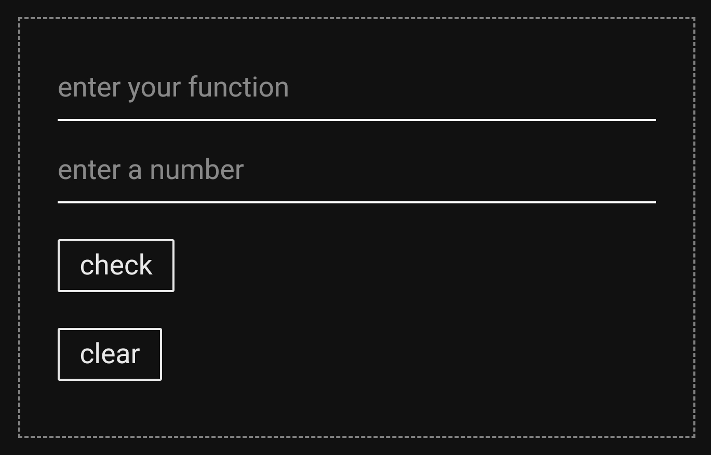

# continuity-test-web

a web version of my project [continuity-test](https://github.com/karim-xyz/continuity-test)

like the original project it uses [sympy](https://github.com/sympy/sympy) for limits and stuff like that

I used  for backend and the [desmos api](https://www.desmos.com/api/v1.11) for graphing



---

## setup

1- clone the repo
```bash
git clone https://github.com/karim-xyz/continuity-test-web
cd continuity-test-web
```
2- install dependencies
```bash
pip install -r requirements.txt # a venv is recommended
```
3- run
```bash
python main.py
```
---

consider opening an issue if you notice anything
